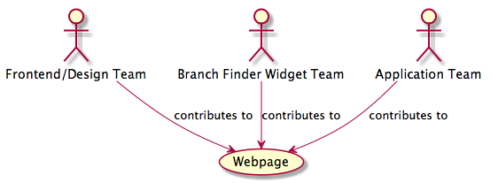
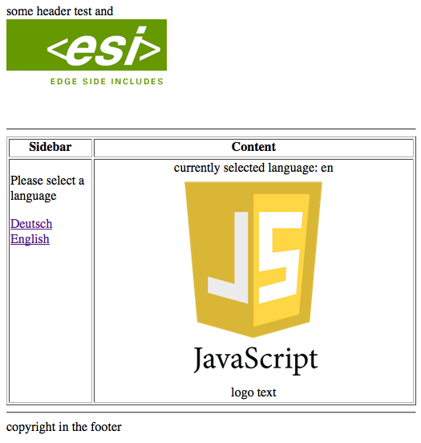

# Javascript Content Aggregation Demo with RequireJS

## Overview

Large organisations struggle finding a way to have different teams deliver parts of the organisation's website. While a certain degree of control is necessary - especially where different sections of a website interact with each other - it is desirable, that the teams can deliver their bits as independently as possible.

This POC examines a way to aggregate html+javascript content on a website and limiting the amount of coupling between different widgets on a page to a minimum.


## Context

Below is an example setup that this POC assumes.



Through various techniques (Edge Side Include, Portal, ...), the work of several independent teams gets physically mashed up on the same page. In most cases, the widgets that get aggregated by the teams should not interfere with each other. In some cases though it might be necessary that 2 widgets communicate with each other. This POC illustrates:

1. how to isolate javascript components from each other using requirejs
2. how to share javascript libraries between components
3. how to allow components to communicate by exchanging events


## Technologies used

- Edge Side Include
    for cross-team/component content aggregation
    see http://www.edge-delivery.org and https://www.varnish-cache.org/trac/wiki/ESIfeatures for more info on ESI

- RequireJS
    for Javascript modularisation, dependency- and load-context management

## Preliminaries

You need to have the following installed in order to run the demo:

- Varnish (or any other frontcontroller that understands <esi:include>
  
    OSX: brew install varnish  
    Note: make sure you have /usr/local/sbin on your path or modify the ./up-all.sh script with the location of your ```varnishd``` binary.

- PHP or Python (for simple static test webserver)

## Running the POC

The demo presents a page on which a user can select a language in the sidebar and the content area states to selected choice. To startup, simply execute the 'up-all.sh' script and in your browser open http://localhost:1234/sampleapp/page.html to see the result. Click on the language links in the sidebar to see the selected language be changed.



## Description

The page aggregates content from different sources:

1. Header
2. Sidebar
3. Application Content
4. Footer


When the page gets loaded, 3 requirejs load contexts are created:

1. default page context

    ```html
    // page.html:8
    <script type="text/javascript" src="/cms/js/lib/require.js"></script>
    <script type="text/javascript" src="/cms/js/main-config.js"></script>
    ```

2. sidebar context

    ```html
    // sidebar.html:2
    <script type="text/javascript">
        require(['/cms/js/sidebar/sidebar-config.js']);
    </script>
    ```

3. content context

    ```html
    // page.html:26
    <script type="text/javascript">
        require(['/sampleapp/js/sampleapp-config.js']);
    </script>
    ```

Each context configuration (main-config, sidebar-config, sampleapp-config) defines the required libraries for that context as well as the entry point script. __sidebar context__ and __content context__ both import shared libraries log4javascript, domReady, jquery and events from the __default context__

## Responsibilities/Requirements

To enable this kind of aggregation, each component must adhere to some constraints 

### 1. The page/master layout must provide minimal Javascript Module Infrastructure

The "master" layout includes RequireJS and synchronously sets up the global RequireJS context in the <html><head> element.

```html
<!-- page.html -->

<!doctype html>
<html lang="en" xmlns="http://www.w3.org/1999/xhtml">
<head>
    ...
    <script type="text/javascript" src="/cms/js/lib/require.js"></script>
    <!-- sync configure global/default requirejs context -->
    <script type="text/javascript" src="/cms/js/main-config.js"></script>
</head>
<body>

  ...

</body>
</html>
```

The global RequireJS context must define the baseUrl for all shared libraries: 

```javascript
// main-config.js

require.config({
    baseUrl: '/cms/js/lib/',
    
    ...
    
});
```

### 2. Each component must define it's own context

The context must

1. have a page-wide unique name
2. import the 'external' requirejs plugin 
3. define the baseUrl for the component
4. list libs to be important by mapping them to an 'external' reference
5. define the component entry point script

```javascript
// sidebar-config.js

define(['external'], function (external) {           // (2.a)
    'use strict';

    define('external', function () {                 // (2.b)
        return external;
    });

    require({
        context: "sidebar",                          // (1)
        baseUrl: "/cms/js/sidebar/",                 // (3)
        map: {
            '*': {                                   // (4)
                'log4js': 'external!log4javascript',
                'domReady': 'external!domReady',
                'jquery': 'external!jquery',
                'events': 'external!events',
            }
        },
    }, ["sidebar-main"], function () {               // (5)
        console.log("sidebar configured");
    });
});
```


## What's *not* demoed

* Configurable context root path for static assets (images, javascripts, ...)

Applications must allow to configure their root context path based on the deployment environment. This becomes especially important when referencing external artifacts like images or javascript files. In a development- or test-environment those scripts will be served from a different location than in production. In production it is likely e.g. that static content like scripts and images will be served via a Content Delivery Network.

E.g. in dev environments images and script urls will typically be referenced using relative urls

```

```

whereas in production environments the same image url will be rendered as full qualified url

```

```

